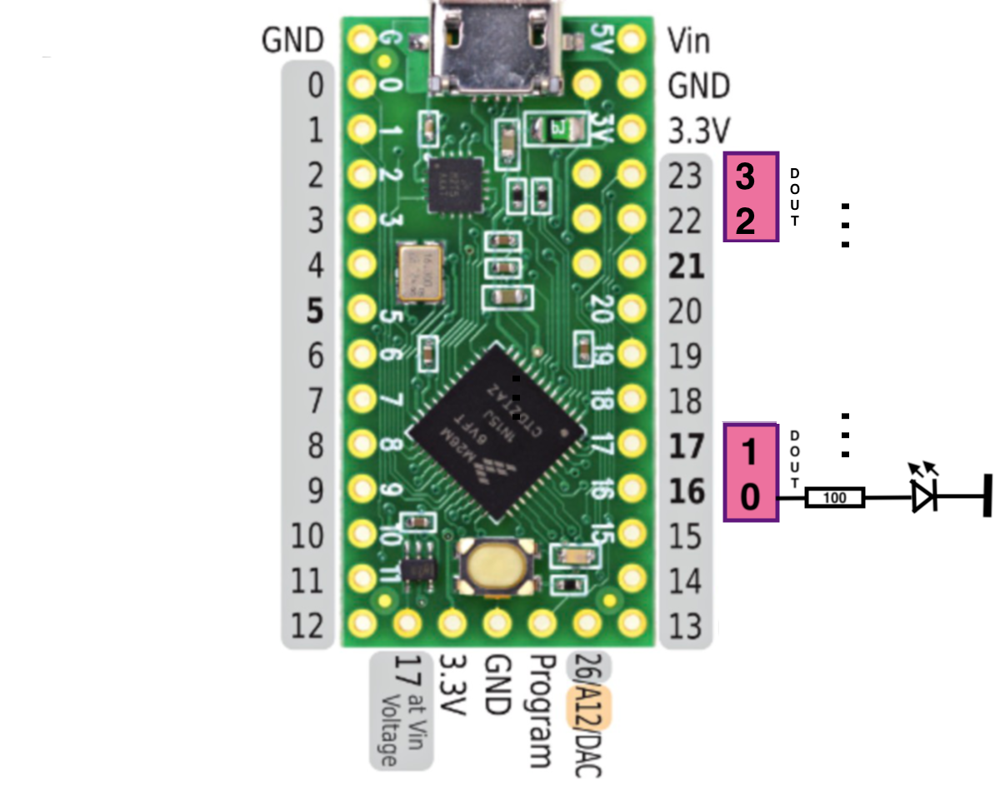

# UsbOut

This project uses a Teensy board to control some digital outputs.
The purpose is to highlight buttons in an arcade cabinet. (Or better to light the LEDs inside the buttons.)
E.g. the available buttons for a specific game are highlighted when a game is started.

You can also set a delay on an output, the intensity and a time for a smooth in/out transition.

This is done through serial communication. E.g. "o2=100" would turn the digital out 2 (DOUT2) to 100%.

On mac you can find the serial device e.g. with:
~~~
$ ls /dev/cu*
$ /dev/cu.Bluetooth-Incoming-Port	/dev/cu.usbmodem56683601
~~~
It's a little bit unclear how the naming is done but it is clear that we are not the Bluetooth device so the right device is:
/dev/cu.usbmodem56683601

To turn on DOUT0 use:
~~~
$ echo o0=100 > /dev/cu.usbmodem56683601
~~~

The full syntax for this command is:
- oN=X[,attack[,delay] : Set output N to X (0-100) with an 'attack' time and a delay.
- 'attack' means that the digital out will change smoothly from its current value to the target (X) within the 'attack' time.
- 'delay' adds an additional delay before 'attack' starts.

All times are in ms.
If you omit the values 0 are assumed for 'attack' and 'delay' and the value of the digital out is changed immediately.

PWM is used to allow to "dim" the digital outputs. 

# HW

Used HW is a cheap Teensy LC board that you can get around 10€.

The pinout is used as following (but can be changed to fit your needs):

# Building the SW

## Prerequisites:

You need to have Arduino installed and also the Teensyduino add-on (https://www.pjrc.com/teensy/teensyduino.html).

## Build the SW:
1. Start Arduino (incl. Teensyduino)
2. Open file "UsbOut.ino"
3. Select "Tools->Boards" = "Teensy LC"
4. Select "Tools->USB Type" = "Serial"
5. Connect the Teensy LC via USB
6. Verify (compile) and Upload the sketch

## Testing:

You can use the serial monitor for testing. Maybe you need to set "Tools->Port" to the correct USB port.

In the serial monitor you can enter "i" followed by a newline.
The SW will send the version information like this:
~~~
Version: 1.0
Last error: None
~~~

Then you could try to turn certain outputs on. E.g. use "d0=100"\<newline\> to turn the digital out with index 0 to ON.
You will get a response from the SW like this:
~~~
DOUT0 (Pin=16) set to 100
~~~

## Configuration:

The digital outs can be mapped to different pins.
This is done in the configuration section in UsbOut.ino via the array 
~~~
uint8_t doutPins[] = { 16, 17, 22, 23 }; 
~~~
Use pins that are capable of PWM. If you use different pins they can only be turned ON (100) or OFF (0).
Only for PWM capable pins it is possible to dim the brightness.

